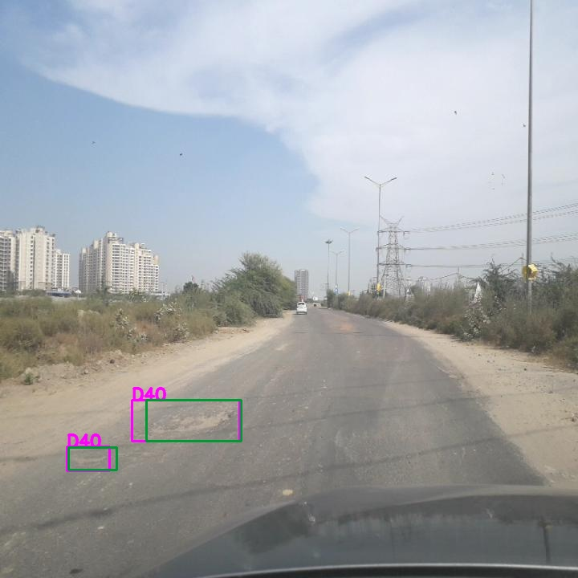
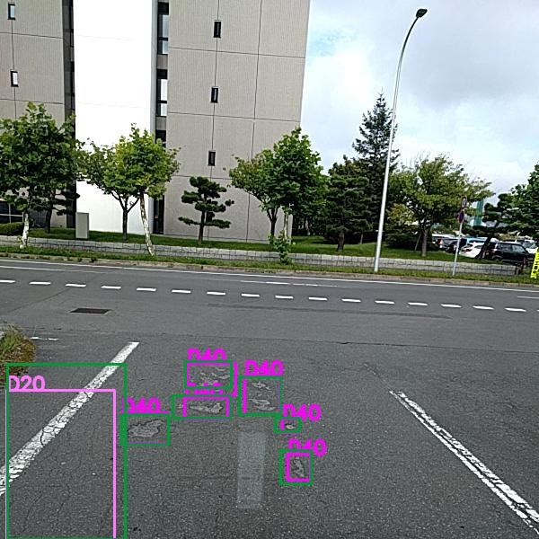
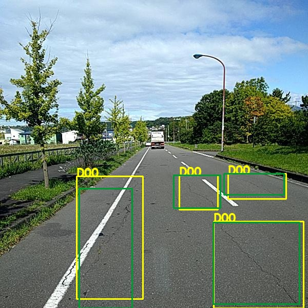
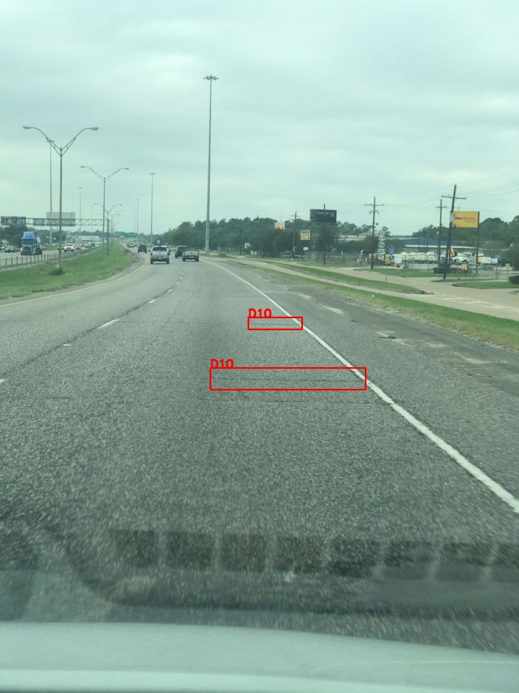
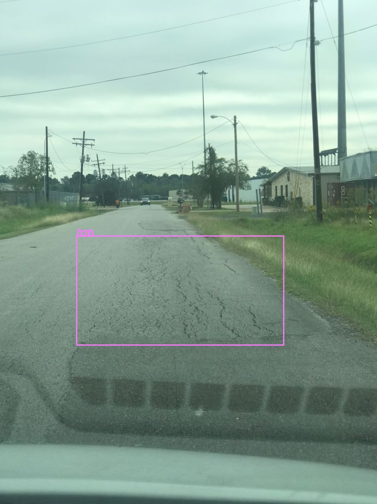
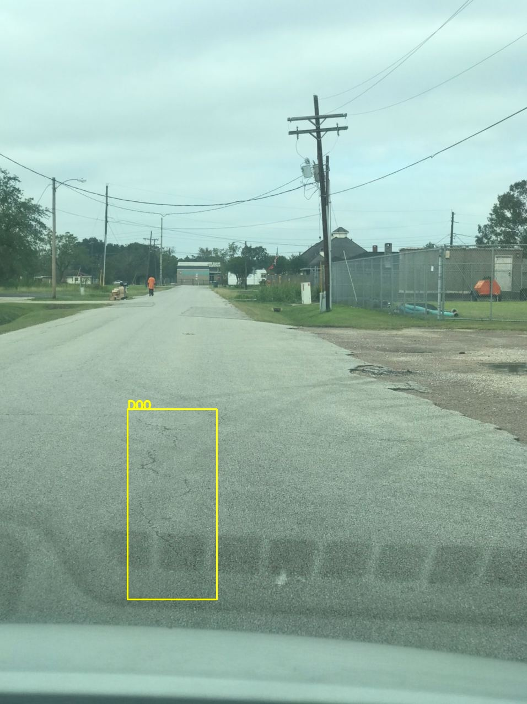
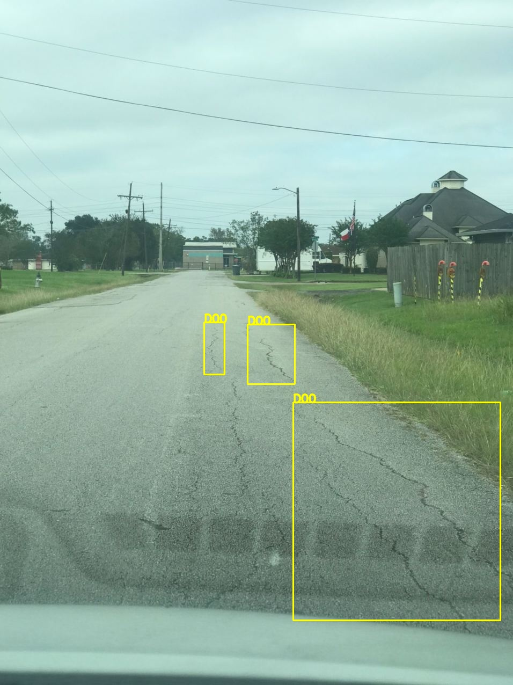

# Road Crack Detection Challange 2020 - IEEE Bigdata Cup Challange
-----
This repository contain codes for paper "An Efficient and scalable deep learning approach for road damage detection" 


The solution is based on EfficientDet paper by Tan et al.


  
  
  
  


#### Model checkpoints 

| Model                  	| Input Image Resolution 	| #params 	| Inf Time (Image/ms)  b=16 	| AP   	| AP50 	| AP75 	| F1    	|
|------------------------	|------------------------	|---------	|:-------------------------:	|------	|------	|------	|-------	|
| D0 [checkpoint](https://drive.google.com/file/d/1E6U21K_DxPOsRx2lKIDDb8MZ8Njjq-xh/view?usp=sharing)      	| 512                    	| 3.9M    	| 178                       	| 19.1 	| 47.2 	| 11.5 	| 54.04 	|
| D0-AUG [checkpoint](https://drive.google.com/file/d/1HFYDYkjkIo2NX42B6zEEceWDS6cyM1A-/view?usp=sharing)  	| 512                    	| 3.9M    	| 178                       	| 19.8 	| 48.5 	| 12.1 	| 54.03 	|
| D1 [checkpoint](https://drive.google.com/file/d/1HFYDYkjkIo2NX42B6zEEceWDS6cyM1A-/view?usp=sharing)      	| 640                    	| 6.5M    	| 147                       	| 21.7 	| 51.5 	| 13.4 	| 56.9  	|
| D1-AUG [checkpoint](https://drive.google.com/file/d/1fH-XqSn1RmY5Oi0lFoDKojzcs8xf5A0Q/view?usp=sharing)  	| 640                    	| 6.5M    	| 147                       	| 22.0 	| 51.7 	| 13.1 	| 56.5  	|
| D2 [checkpoint](https://drive.google.com/file/d/1b_-N8Txo7irYWxt4MWfVgs016jj2heil/view?usp=sharing)       	| 768                    	| 8M      	| 100                       	| 22.9 	| 53.5 	| 14.9 	| 56.7  	|
| D2-AUG [checkpoint](https://drive.google.com/file/d/1fw34x7w7cWumBZ6X6Z186rArANeGhxuw/view?usp=sharing)  	| 768                    	| 8M      	| 100                       	| 22.9 	| 54.2 	| 15.2 	| 56.6  	|
| D3 [checkpoint](https://drive.google.com/file/d/1_9gXbJzFgWuaF3v3-ONnH-vOhxiIQYAV/view?usp=sharing)       	| 796                    	| 11.9M   	| 57                        	| 23.0 	| 53.4 	| 15.0 	| 56.5  	|
| D3- AUG [checkpoint](https://drive.google.com/file/d/1VpH6HPFWNuiv88zT_cYOKSFM67A4PlpQ/view?usp=sharing) 	| 796                    	| 11.9M   	| 57                        	| 22.6 	| 53.4 	| 14.7 	| 56.8  	|
| D4 [checkpoint](https://drive.google.com/file/d/1LdGPqPPQRP8gj8ZcEtfYNP4rbBN1GqkK/view?usp=sharing)      	| 1024                   	| 20.5M   	| 38                        	| 22.8 	| 53.3 	| 15.1 	| 57.2  	|
| D7-AUG [checkpoint](https://drive.google.com/file/d/1wVNMeAMHyS85qJ1hsxLxnzFpVw_oT8Mz/view?usp=sharing)  	| 1536                   	| 51M     	| 10                        	| 23.4 	| 53.6 	| 15.0 	| 56.5  	|
##### Usage

Consider unisng a workspace for cleaner 

1. install required Libraries : 

- python>= 3.6
- pytorch 1.4 or 1.6
- torchvision >= 0.5
- apex is also needed
- timm >= 1.28


`pip install -r requirements.txt` 

install apex : 

```
apt-get install  git
git clone https://github.com/NVIDIA/apex
pip install -r apex/requirements.txt
pip install -v --no-cache-dir ./apex 
```


2. download Dataset :
for ease of use we have provided annotations and ... in coco format downloadable from this [link](https://drive.google.com/file/d/1IHaqAxpMtFwPHia7msB_1QPAywPgg7fW/view?usp=sharing). 


otherwise one can download original data from sekilab github repo and convert using tools provided in utils folder.
 

3. for training : 

- Train on single GPU : 
```
python train.py ../data --model tf_efficientdet_d0 -b 40 --amp --lr .15 --sync-bn --opt fusedmomentum --warmup-epochs 3 --lr-noise 0.3 0.9 --model-ema --model-ema-decay 0.9998 -j 25 --epochs 300
```

- Distributed Training : 
```
./distributed_train.sh 3 ../data --model tf_efficientdet_d0 -b 40 --amp --lr .15 --sync-bn --opt fusedmomentum --warmup-epochs 3 --lr-noise 0.3 0.9 --model-ema --model-ema-decay 0.9998 -j 25 --epochs 300 
```

4. for inference on testset and generating submission file :
```
python code/infer.py ./data --model tf_efficientdet_d0 --checkpoint ./path/to/model/checkpoint --use-ema --anno test1 -b 17 --mean 0.4535 0.4744 0.4724 --std 0.2835 0.2903 0.3098 -t 0.300
```
5. Image Inference to generate detected images

- first create image_info_annotations(e.g. if image folder is in `../data` path. One should first create image info in json format using `python utils/createimageinfo.py` then folder structure should be like )

```
..
├── data
│   └── annotations
|       ├── image_info_testfolder.json
├── testfolder
│   ├── Japan_XXX.jpg
│   └── Czech_xxx.jpg
|   └── ....

```

following command will create generated file with bounding boxes in ./predictions
```
python detector.py ../data --model tf_efficientdet_d0 --checkpoint path.to/modelfile.pth.tar --anno testfolder  -b 20 --use-ema  --tosave ./predictions 
```

### Utils 

Some utils are provided in utils folder such as  tools to calculate anchor boxes ratis mean and std of train set and validation set and ... .


### cite 
Please cite if you use paper or code : 

To be announced


### other repos used :

 - a pytorch implementation of efficientDet by rwightman
 - timm pytorch model tools 
 - apex.
 - effientDet paper
 - k-means anchor calculator.
